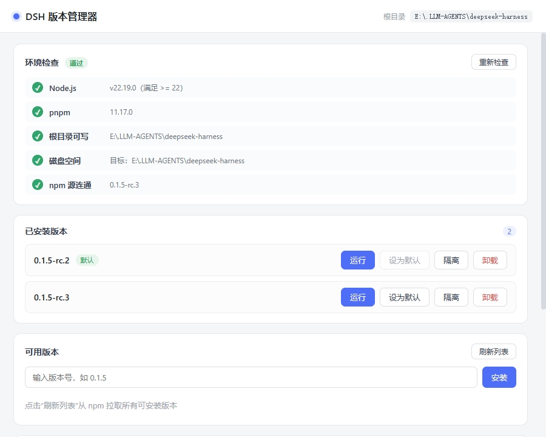
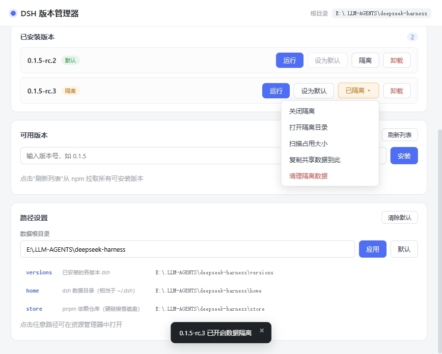

# dsh-multiver

一个**轻量、便携**的 DeepSeek Harness（dsh）版本管理器，用于在同一台机器上安装、切换、运行多个 dsh 版本。

- 🪶 **极致轻量**：约 4.5 MB 单 exe，无需安装，双击即用
- 💾 **省磁盘**：用 pnpm store 硬链接，多个版本共享依赖文件
- 🩺 **安装前自检**：自动检查 Node / pnpm / 磁盘 / 源连通
- 📊 **细粒度进度**：实时显示「解析依赖 → 下载 → 写入 → 构建原生模块 → 完成」
- 🔒 **可选数据隔离**：每个版本可用独立数据目录，测试插件不污染主力环境
- ⚙️ **完全自定义**：数据根目录、DSH_HOME、store 位置都可在界面配置
- 🖥️ **内嵌窗口运行**：点「运行」在应用内直接打开 dsh Web 界面（每个版本独立 WebView2 缓存，互不污染），也可一键在系统浏览器打开
- 🚀 **桌面快捷方式**：为任意版本在桌面生成 `DSH <版本号>.lnk`，双击直达对应版本

## 截图

主界面 —— 环境自检、已安装版本、可用版本与安装：



数据隔离（独立数据目录）与路径设置：



## 下载

从 [Releases](https://github.com/K1-lihongrong/dsh-multiver/releases) 下载最新的 `dsh-multiver.exe`，放到任意目录，双击运行。

> 需要系统已安装 **WebView2**（Windows 11 及 Windows 10 1803+ 自带）。

## 使用

1. 双击 `dsh-multiver.exe`
2. 界面顶部会**自动检查环境**（Node / pnpm / 磁盘 / 源）
3. 点「刷新列表」从 npm 拉取可安装的版本
4. 点版本号安装，观察阶段式进度
5. 点「运行」即可在应用**内嵌窗口**中打开该版本的 `dsh web`，或点「浏览器打开」在系统浏览器中打开

数据默认存放在 **exe 所在目录**下（`versions/`、`home/`、`store/`），也可在界面「路径设置」里改到任意位置。

### 运行方式

安装完成后，每个版本都有三种启动途径：

- **运行（内嵌窗口）**：在应用内直接打开 dsh Web 界面（默认 1100×760）。每个版本使用独立的 WebView2 数据目录（`<数据根>/webview/<版本>`），长期累积的 cookie/缓存互不污染，也不会因请求头膨胀触发 dsh 的 `431 / Failed to load plugins`。关闭窗口会自动终止该版本进程；同一版本再次运行会先结束旧实例再重新打开。
- **浏览器打开**：用一个新控制台窗口启动 dsh，并让 dsh 自动打开系统默认浏览器（端口固定在 `3080`）。若端口被占用，会弹出对话框让你选择「换随机端口」或取消；若该版本已在内嵌窗口运行，也会先弹窗确认是否再开一个。
- **桌面快捷方式**：点按钮为当前版本在桌面生成 `DSH <版本号>.lnk`，双击即可直达该版本——适合常玩的版本直接放桌面。

### 终端短命令

在某个版本上点「设为默认」后，会在 `%APPDATA%\npm\` 生成 `dsh.cmd` 转发脚本（该目录已在系统 PATH）。之后在**任意终端**直接敲 `dsh` 即可运行已设为默认的版本。

特别是，dsh 的 Web 界面也可以用终端短命令启动 —— 执行：

```bash
dsh web
```

这条命令会把请求转发到已「设为默认」的版本并启动它的 Web 界面，效果与界面上的「运行」按钮一致。其他 dsh 子命令（如 `dsh doctor`、`dsh --version`）同样会命中默认版本。

### 数据隔离

点某个版本的「隔离」按钮，可为它开启独立数据目录（`versions/<版本号>/home/`）。隔离版本的会话、插件、配置与共享环境互不干扰，适合测试不兼容插件。

隔离版本的「已隔离 ▾」菜单还提供：

- 打开隔离目录
- 扫描占用大小
- 复制共享数据到此（不覆盖已存在文件）
- 清理隔离数据

## 与其他 dsh 工具的区别

dsh 生态里已有几个相关工具，`dsh-multiver` 的定位与它们不同：

| 工具 | 定位 | 数据隔离 | 省磁盘 | 环境自检 | 形态 |
| :--- | :--- | :--- | :--- | :--- | :--- |
| **dsh-multiver** | 版本管理 + 省磁盘 + 自检 | ✅ 可选 | ✅ pnpm store 硬链接 | ✅ 5 项（含磁盘/源） | 4.5 MB 单 exe |
| [dshvm](https://github.com/dsh-so/dshvm) | 版本管理 + 数据隔离 | ✅（核心特性） | 未强调 | ✅ 引导页 | Tauri + CLI |
| [dsh-launcher](https://github.com/NevermindZZT/dsh-launcher) | 一键启动 | ❌ | N/A | ✅ doctor | 2 MB 单文件 |

**简而言之**：

- 需要**最彻底的数据隔离** → 推荐 dshvm
- 只需要**一键启动** → 推荐 dsh-launcher
- 想要**省磁盘 + 安装前自检 + 便携单文件** → 用 dsh-multiver

## 核心机制

### 为什么用 `node-linker=hoisted`

dsh 运行时按 Node 常规方式解析依赖。pnpm 默认的**符号链接**结构会导致：

```
Error: Cannot find package '...\node_modules\.pnpm\node_modules\@deepseek-ai\cordis\index.js'
```

因此每个版本目录会写入 `.npmrc`：

```
node-linker=hoisted
```

生成扁平化的真实 `node_modules`（兼容 dsh），同时底层仍用 store 硬链接保持去重。

### 为什么要允许构建脚本

pnpm 10+ 默认**不执行**依赖的构建脚本，会导致 `ERR_PNPM_IGNORED_BUILDS`（node-pty、koffi 等原生模块缺失）。安装时使用：

```
--config.dangerouslyAllowAllBuilds=true
```

## 开发

```bash
# 安装依赖
pnpm install

# 开发模式（热重载）
pnpm tauri dev

# 打包便携版单 exe
pnpm tauri build --no-bundle

# 重新生成图标（修改 icon-source.svg 后）
node gen-icons.mjs
```

产物位置：`src-tauri/target/release/dsh-multiver.exe`

### 环境要求

- Node.js `^22.19.0` 或 `>=24`
- pnpm（建议 11.x）
- Rust 工具链 + MSVC C++ 构建工具 + Windows SDK

## 技术栈

- **外壳**：Tauri 2（Rust）
- **前端**：Vite 8 + Vue 3
- **打包**：便携版单 exe

## 已知限制

- 便携版单 exe 不含 WebView2 与 VC++ 运行时，极老或纯净版 Win10 可能需手动安装 WebView2
- 终端 `dsh` 转发脚本写入 `%APPDATA%\npm\`，该目录需在 PATH 中
- Windows 图标有缓存，更新 exe 后若图标未变，需清缓存（`ie4uinit.exe -show` 或重启资源管理器）
- 使用 npm 官方源时，国内下载可能较慢；淘宝镜像同步滞后，可能出现子包缺失

## 致谢

- [DeepSeek Harness](https://github.com/deepseek-ai/deepseek-harness) — 本项目管理的对象
- [Tauri](https://tauri.app/) — 应用外壳
- [Vue](https://vuejs.org/) — 前端框架

## License

[MIT](LICENSE)
