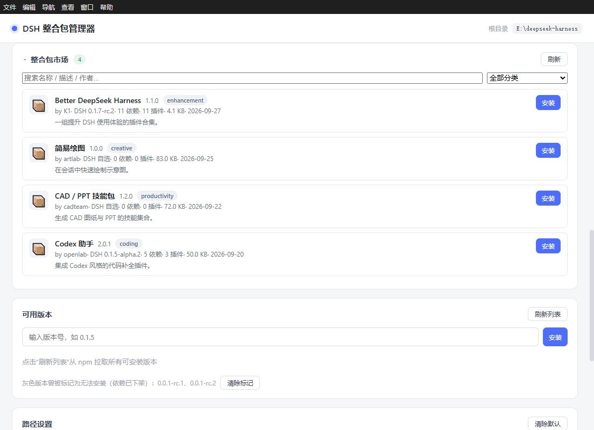
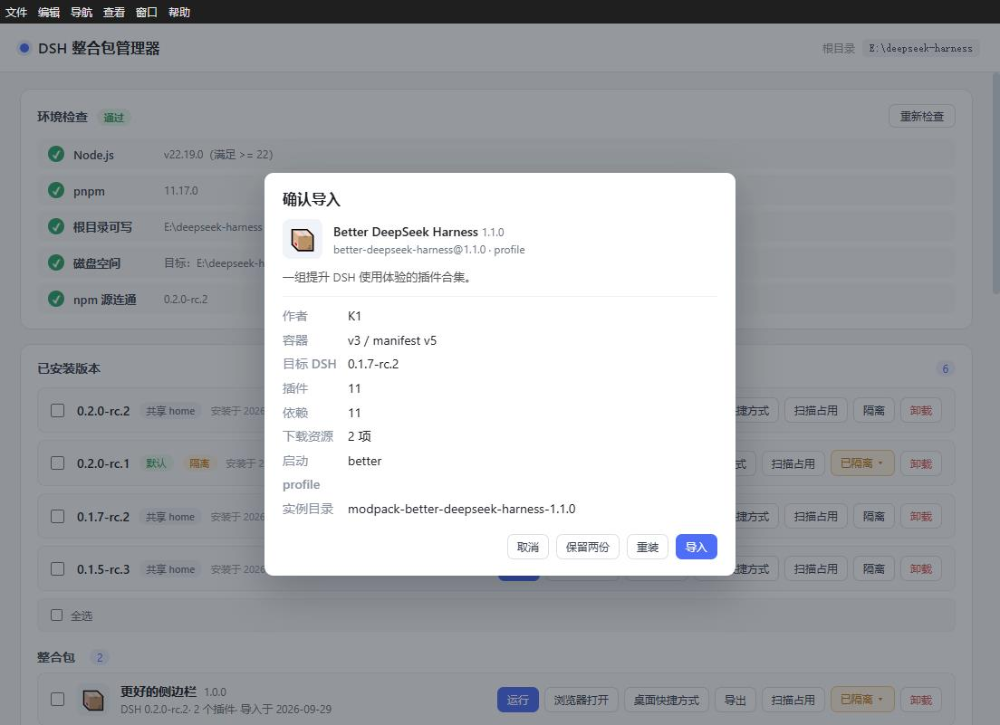
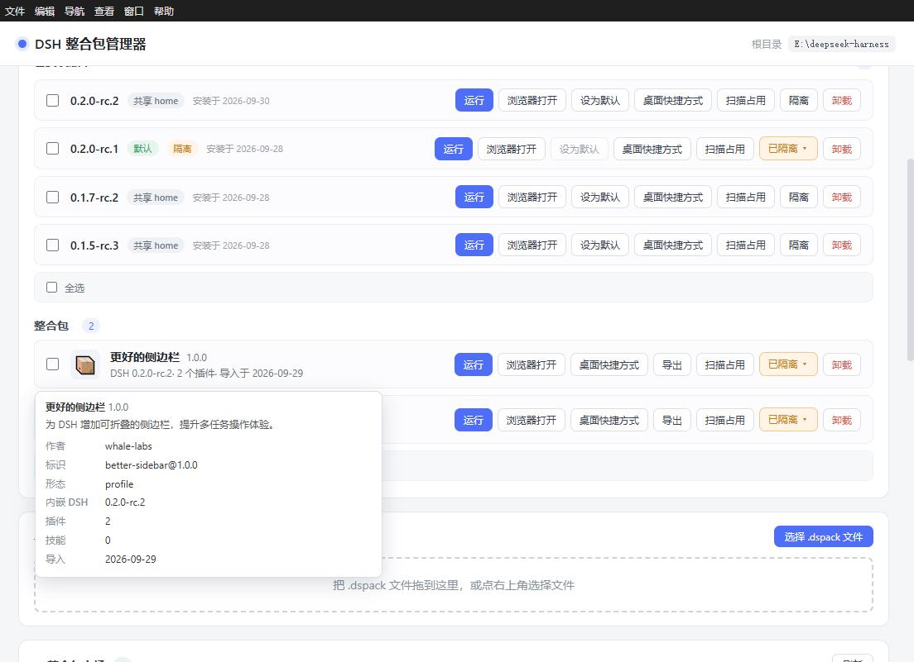
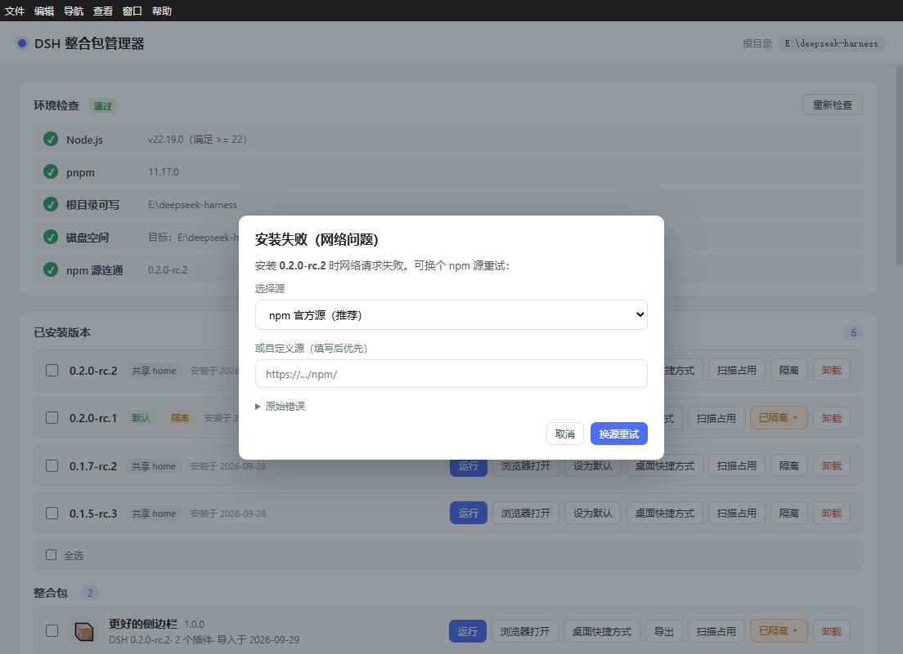

# DSH 整合包管理器（dsh-modpack）

一个**轻量、便携**的 DeepSeek Harness（dsh）桌面工具，既能管理多个 dsh 版本，又能一键导入、运行、导出 **DSH-PackForge 整合包**（`.dspack`）。

> 本项目是 [dsh-multiver](https://github.com/K1-lihongrong/dsh-multiver) 的**平行分支**，在其基础上增加了整合包生态支持。
> 主干 `dsh-multiver` 专注版本管理；本分支产物为 `dsh-modpack.exe`，两者可并存。

## 亮点

**整合包（本分支新增）**

- 📦 **一键导入** `.dspack` 整合包：拖拽 / 文件对话框 / 命令行三种入口，四阶段导入 + 失败全量回滚
- 🛒 **整合包市场**：直接浏览市场索引，搜索/分类、查看已安装标记、一键下载安装
- 📤 **导出整合包**：把本地实例导出为 `.dspack`，便于分享
- 🖥️ **无头 CLI**：`--import <路径> --yes` 不启 GUI，进度逐行输出，退出码 0/1，可脚本化
- 🔒 **目录隔离**：整合包实例放在 `modpacks/`，与普通版本 `versions/` 分开，互不干扰
- ⚡ **智能复用**：纯技能包可 junction 复用本机已装 dsh，导入从 20s+ 降到秒级
- 🧭 **错误诊断**：安装失败按类别（网络/插件依赖/运行时/文件占用/磁盘）给出针对性建议

**版本管理（继承主干）**

- 🪶 **极致轻量**：约 4.5 MB 单 exe，无需安装，双击即用
- 💾 **省磁盘**：用 pnpm store 硬链接，多个版本共享依赖文件
- 🩺 **安装前自检**：自动检查 Node / pnpm / 磁盘 / 源连通，缺失时给下载引导
- 📊 **细粒度进度**：实时显示安装阶段与依赖进度百分比
- 🔁 **换源重试**：安装失败可切换 npm 源（官方 / 阿里云 / 腾讯云 / 华为云）重试
- 🔒 **可选数据隔离**：每个版本可用独立数据目录，测试插件不污染主力环境
- 🖥️ **内嵌窗口运行**：在应用内直接打开 dsh Web 界面，也可一键在系统浏览器打开
- 🚀 **桌面快捷方式**：为任意实例在桌面生成快捷方式，双击直达

## 截图

> 下列截图占位，待补。放入 `docs/screenshots/` 后即可显示。

主界面 —— 环境自检、已安装实例（版本 / 整合包分组）、批量操作：


整合包市场 —— 浏览、搜索、一键安装：



导入整合包 —— 拖入 `.dspack` 后的预览确认框：



整合包卡片详情 —— 悬停查看作者 / 插件数 / 技能数：



安装失败换源重试：



数据隔离（独立数据目录）与路径设置：


## 下载

从 [Releases](https://github.com/K1-lihongrong/dsh-multiver/releases) 下载最新的 `dsh-modpack.exe`（整合包分支版本 tag 形如 `modpack-v0.1.5`），放到任意目录，双击运行。

> 需要系统已安装 **WebView2**（Windows 11 及 Windows 10 1803+ 自带）。

## 使用

### 导入整合包

三种入口，任选其一：

1. **拖拽**：把 `.dspack` 文件拖到窗口上
2. **文件对话框**：点「导入整合包」区的「选择 .dspack 文件」
3. **命令行**：`dsh-modpack.exe --import <路径.dspack>`（弹 GUI 预览框，需人工确认）

导入流程：预检 → 解包落盘 → 安装依赖 → 下载资源 → 完成。任一阶段失败会**整体回滚**（回到未导入状态）。同名同版本已存在时，可选「重装 / 保留两份 / 取消」。

### 无头 CLI 导入（可自动化）

加 `--yes` 进入无头模式：不启动 GUI，进度逐行打到 stdout，末行 `OK: <实例名>` 或 `ERROR: <原因>`，退出码 0/1。冲突时默认「保留两份」（自动加后缀）。

```bash
dsh-modpack.exe --import "path\to\pack.dspack" --yes
```

### 市场

展开「市场」面板即可浏览市场索引：搜索 / 按分类过滤 / 已安装标记 / 一键下载安装。

### 导出整合包

在整合包卡片上点「导出」，把本地实例打包为 `.dspack`（CLI：`--export <实例> <目标路径>`）。

### 运行整合包

导入的整合包是**独立隔离实例**，点「运行」即在应用内嵌窗口打开其 Web 界面（启动 `dsh --profile <profile名>`）。顶部小栏显示包名、版本与内嵌 DSH 版本。

### 版本管理

与主干一致：

1. 双击 `dsh-modpack.exe`，界面顶部**自动检查环境**
2. 点「刷新列表」从 npm 拉取可安装的 dsh 版本
3. 点版本号安装（支持失败换源重试）
4. 点「运行」在内嵌窗口打开，或「浏览器打开」用系统浏览器

数据默认存放在 **exe 所在目录**下，也可在「路径设置」里改。

### 运行方式

每个实例都有三种启动途径：

- **运行（内嵌窗口）**：应用内直接打开 dsh Web 界面。每个实例使用独立的 WebView2 数据目录（`<数据根>/webview/<实例>`），互不污染，也不会因请求头膨胀触发 `431 / Failed to load plugins`。关闭窗口自动终止该实例进程。
- **浏览器打开**：新控制台启动 dsh 并打开系统浏览器（端口固定 `3080`，占用时弹框选择换端口或取消）。
- **桌面快捷方式**：为实例在桌面生成快捷方式，双击直达。

### 批量操作

版本列表与整合包列表都支持多选：勾选后底部出现批量操作栏，可「全选本组 / 清除选择 / 批量卸载」（一次确认，逐个执行，失败项汇总提示）。

### 终端短命令

对**普通版本**点「设为默认」后，会在 `%APPDATA%\npm\` 生成 `dsh.cmd` 转发脚本。之后在任意终端敲 `dsh` 即命中默认版本。

> 整合包实例天然隔离，不参与「设为默认」（终端转发机制只认 `versions/` 下的普通版本）。

## 与主干 dsh-multiver 的区别

| 项 | dsh-multiver（主干） | dsh-modpack（本分支） |
| :--- | :--- | :--- |
| 定位 | dsh 版本管理 | 版本管理 + **整合包生态** |
| 产物 | `dsh-multiver.exe` | `dsh-modpack.exe` |
| tag 前缀 | `v*` | `modpack-v*` |
| 整合包实例目录 | — | `modpacks/`（不混入 `versions/`） |
| 市场 / 导出 / 无头 CLI | — | ✅ |

两者**可共存、共用数据根**：主干只扫描 `versions/`，分支的整合包放在 `modpacks/`，互不干扰，共享 `store/` 省磁盘。

## 目录结构

```
<数据根>/
├── config.json              # 配置（root_dir / default_version / isolated_versions / broken_versions）
├── versions/                # 普通 dsh 版本
├── modpacks/                # 整合包实例（每个是一个独立隔离实例）
│   └── modpack-<name>-<ver>/
│       ├── package.json     # 由 manifest 权威重建
│       ├── .npmrc           # node-linker=hoisted
│       ├── node_modules/    # dsh 本体 + 依赖（或 junction）
│       ├── home/            # 隔离 DSH_HOME
│       └── .dsh-multiver-meta.json  # 实例元数据
├── home/                    # 共享 DSH_HOME（非隔离版本）
├── store/  cache/  state/   # pnpm 目录（自包含，不写全局）
├── webview/                 # 各实例 WebView2 数据（cookie/缓存隔离）
└── logs/
```

## 核心机制

### 为什么用 `node-linker=hoisted`

dsh 运行时按 Node 常规方式解析依赖。pnpm 默认的**符号链接**结构会导致 `Cannot find package ...`。因此每个实例目录写入 `.npmrc`：

```
node-linker=hoisted
```

生成扁平化真实 `node_modules`（兼容 dsh），底层仍用 store 硬链接去重。

### 为什么要允许构建脚本

pnpm 10+ 默认**不执行**依赖构建脚本，会导致 `ERR_PNPM_IGNORED_BUILDS`（node-pty、koffi 等原生模块缺失）。安装时使用 `--config.dangerouslyAllowAllBuilds=true`。

### 整合包启动为什么用 `--profile`

dsh 的 `web` 是一个 **profile 名**（`dsh web` 等价 `--profile web`）。整合包自带 profile，启动时用 `dsh --profile <profile名>`。profile 定义须在 `$DSH_HOME/profiles/<名>/` 下，含三件套：`package.json` + `cordis.patch.yml` + `pnpm-workspace.yaml`。

## 开发

```bash
# 安装依赖
pnpm install

# 开发模式（热重载）
pnpm tauri dev

# 打包便携版单 exe
pnpm tauri build --no-bundle

# 重新生成图标（修改 icon-source.svg 后）
node gen-icons.mjs
```

产物位置：`src-tauri/target/release/dsh-modpack.exe`

### 环境要求

- Node.js `^22.19.0` 或 `>=24`
- pnpm（建议 11.x）
- Rust 工具链 + MSVC C++ 构建工具 + Windows SDK

## 技术栈

- **外壳**：Tauri 2（Rust）
- **前端**：Vite 8 + Vue 3
- **整合包协议**：DSH-PackForge（`protocol-2026-09`）
- **打包**：便携版单 exe

## 已知限制

- 便携版单 exe 不含 WebView2 与 VC++ 运行时，极老或纯净版 Win10 可能需手动安装 WebView2
- 终端 `dsh` 转发脚本写入 `%APPDATA%\npm\`，该目录需在 PATH 中
- 部分上游 dsh 版本依赖已下架的私有包，任何源都无法安装（界面会标灰并提示换版本）
- 使用 npm 官方源时国内下载可能较慢；淘宝镜像同步滞后，可能出现子包缺失
- 整合包 `type:"dshhome"` 形态代码已实现，但当前生态无真实样本可验证

## 致谢

- [DeepSeek Harness](https://github.com/deepseek-ai/deepseek-harness) — 本项目管理的对象
- [DSH-PackForge](https://github.com/DSH-PackForge/DSH-PackForge) — 整合包格式规范
- [Tauri](https://tauri.app/) — 应用外壳
- [Vue](https://vuejs.org/) — 前端框架

## License

[MIT](LICENSE)
