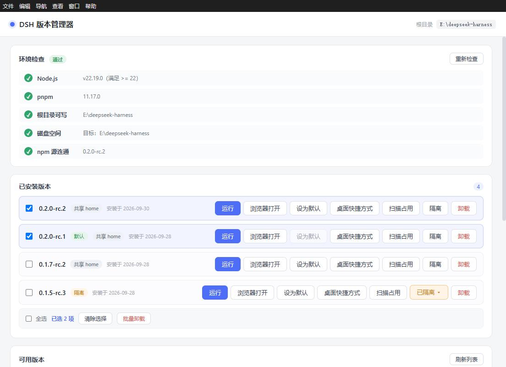
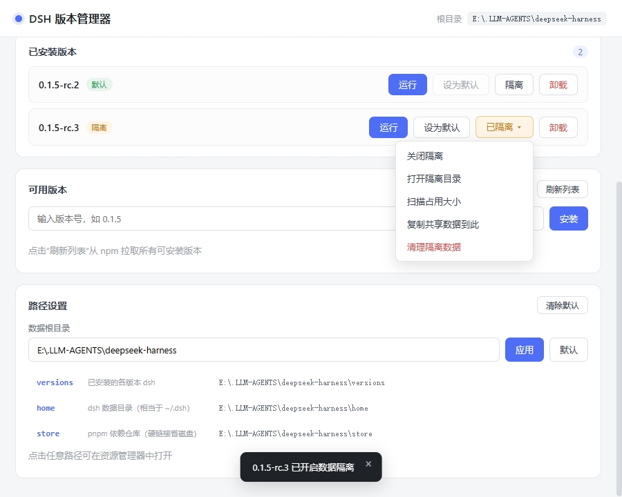

# dsh-multiver

一个**轻量、便携**的 DeepSeek Harness（dsh）版本管理器，用于在同一台机器上安装、切换、运行多个 dsh 版本。

- 🪶 **极致轻量**：Windows 约 7 MB 单 exe，无需安装，双击即用
- 💾 **省磁盘**：用 pnpm store 硬链接，多个版本共享依赖文件
- 📖 **版本更新说明**：点版本号即可就地查看该版本的更新说明（数据来自 dsh 上游 Releases），装之前先了解改了什么
- 🩺 **安装前自检 + 引导**：自动检查 Node / pnpm / 磁盘 / 源连通，缺失时给出下载链接与安装步骤
- 📊 **细粒度进度**：实时显示安装阶段与依赖进度百分比
- 🔁 **失败换源重试**：安装失败按类别提示（网络 / 私有包 / 版本不完整），网络问题可一键换 npm 源重试
- 🚫 **失败版本标记**：依赖已下架的版本自动标灰，避免反复踩坑
- ☑️ **批量操作**：多选版本一键批量卸载（含防呆禁用）
- 🔒 **可选数据隔离**：每个版本可用独立数据目录，测试插件不污染主力环境
- ⚙️ **完全自定义**：数据根目录、DSH_HOME、store 位置都可在界面配置
- 🖥️ **内嵌窗口运行**：点「运行」在应用内直接打开 dsh Web 界面（每个版本独立 WebView2 缓存，互不污染），也可一键在系统浏览器打开
- 🚀 **桌面快捷方式**：为任意版本在桌面生成 `DSH <版本号>.lnk`，双击直达对应版本
- 🧹 **自动维护**：启动时清理孤立 webview 缓存，定期回收 pnpm store
- ⌨️ **无头 CLI**：`--list` / `--install` / `--uninstall` / `--set-default` / `--maintenance`，不启动界面即可完成全部操作，方便脚本化

## 截图

主界面 —— 环境自检、已安装版本（含批量操作）、可用版本与安装：



数据隔离（独立数据目录）与路径设置：



## 下载

从 [Releases](https://github.com/K1-lihongrong/dsh-multiver/releases) 下载：

| 平台 | 文件 | 说明 |
| :--- | :--- | :--- |
| **Windows** | `dsh-multiver.exe` | 便携版，放到任意目录双击运行（需 WebView2，Win11 及 Win10 1803+ 自带） |
| **Linux（通用）** | `dsh-multiver_*_amd64.AppImage` | 免安装，`chmod +x` 后运行（需 WebKitGTK） |
| **Linux（Debian/Ubuntu）** | `dsh-multiver_*_amd64.deb` | `sudo dpkg -i` 安装 |

📖 **完整操作说明见 [使用手册](docs/使用手册.md)** —— 含环境准备、各项功能、常见问题排查。

🔍 **遇到问题？见 [问题日志查看指南](docs/问题日志查看指南.md)** —— 日志在哪、各记录什么、按现象怎么查。

🐧 **Linux**：原生支持，已在 Debian 13 上完成编译/测试/GUI/CLI/进程清理验证；产物为 AppImage 与 deb。详见 [使用手册 · Linux 支持](docs/使用手册.md#十三linux-支持)。

## 使用

1. 启动程序（Windows 双击 `dsh-multiver.exe`；Linux 运行 AppImage 或安装 deb 后启动）
2. 界面顶部会**自动检查环境**（Node / pnpm / 磁盘 / 源）；缺失项会给出下载链接与安装步骤
3. 点「刷新列表」从 npm 拉取可安装的版本
4. 点版本号安装，观察阶段式进度；失败时按类别提示，网络问题可换源重试
5. 点「运行」即可在应用**内嵌窗口**中打开该版本的 `dsh web`，或点「浏览器打开」在系统浏览器中打开

数据默认存放在 **exe 所在目录**下（`versions/`、`home/`、`store/`），也可在界面「路径设置」里改到任意位置。

### 运行方式

安装完成后，每个版本都有三种启动途径：

- **运行（内嵌窗口）**：在应用内直接打开 dsh Web 界面（默认 1100×760）。每个版本使用独立的 WebView2 数据目录（`<数据根>/webview/<版本>`），长期累积的 cookie/缓存互不污染，也不会因请求头膨胀触发 dsh 的 `431 / Failed to load plugins`。关闭窗口会自动终止该版本进程；同一版本再次运行会先结束旧实例再重新打开。
- **浏览器打开**：用一个新控制台窗口启动 dsh，并让 dsh 自动打开系统默认浏览器（端口固定在 `3080`）。若端口被占用，会弹出对话框让你选择「换随机端口」或取消；若该版本已在内嵌窗口运行，也会先弹窗确认是否再开一个。
- **桌面快捷方式**：点按钮为当前版本在桌面生成 `DSH <版本号>.lnk`，双击即可直达该版本——适合常玩的版本直接放桌面。

### 安装失败处理

安装失败时按错误类别给出针对性提示：

- **网络问题**：弹出换源对话框，可从官方 / 阿里云 npmmirror / 腾讯云 / 华为云中选择，或填自定义源，一键重试
- **私有包下架 / 版本不完整**：提示换用更新的版本，并给出进阶方案
- 失败的版本会在列表中标灰划线；用户可手动「清除标记」后重试

### 批量操作

已安装列表支持多选：

- 每个版本左侧有复选框，勾选后底部出现批量操作栏
- 「全选」一键选中本组；「清除选择」取消
- 「批量卸载」一次确认后逐个卸载，实时显示进度，失败项汇总提示
- 批量进行中，选中项的按钮会被禁用（防呆），避免重复操作

### 终端短命令

在某个版本上点「设为默认」后，会在 `%APPDATA%\npm\` 生成 `dsh.cmd` 转发脚本（该目录已在系统 PATH）。之后在**任意终端**直接敲 `dsh` 即可运行已设为默认的版本。

特别是，dsh 的 Web 界面也可以用终端短命令启动 —— 执行：

```bash
dsh web
```

这条命令会把请求转发到已「设为默认」的版本并启动它的 Web 界面，效果与界面上的「运行」按钮一致。其他 dsh 子命令（如 `dsh doctor`、`dsh --version`）同样会命中默认版本。

### 数据隔离

点某个版本的「隔离」按钮，可为它开启独立数据目录（`versions/<版本号>/home/`）。隔离版本的会话、插件、配置与共享环境互不干扰，适合测试不兼容插件。

隔离版本的「已隔离 ▾」菜单还提供：

- 打开隔离目录
- 扫描占用大小
- 复制共享数据到此（不覆盖已存在文件）
- 清理隔离数据

### 查看版本更新说明

点「可用版本」的版本号 chip、或「已安装版本」的版本号，即可就地展开该版本的更新说明
（数据来自 dsh 上游 GitHub Releases，Markdown 已由 GitHub 渲染为 HTML，经白名单消毒后展示）。
标题栏整行可点收起，附「在浏览器打开原文」按钮。装之前就能了解每个版本改了什么。
说明按版本缓存：同一个版本看过一次后，再点（无论从哪条路径）都会立即显示。

### 路径设置

「路径设置」面板可直接打开各数据目录（点击任意路径行即在文件管理器打开）。
默认展示 5 个核心目录（`versions` / `home` / `store` / `cache` / `state`），
点「**展开全部目录**」可查看 `logs` / `webview` / `trash` / `assets` 等其余目录。
数据根目录可在此修改（自动去除首尾空格）。

### 自动维护

程序启动时会在后台（不阻塞界面）：

- 清理孤立的 webview 数据目录（对应版本已卸载的）
- 距上次 7 天以上时，低优先级运行 `pnpm store prune` 回收未引用的包

日志写在 `<数据根>/logs/maintenance.log`。

### 命令行模式（CLI）

v0.1.8 起支持**无头 CLI** —— 带任一 CLI 参数时不启动图形界面，执行完按退出码退出（成功 `0` / 失败 `1`）：

```bash
dsh-multiver.exe --list                                    # 列出已安装版本
dsh-multiver.exe --install <版本> [--registry <url>]       # 无头安装
dsh-multiver.exe --uninstall <版本>                        # 无头卸载
dsh-multiver.exe --set-default <版本>                      # 设默认版本
dsh-multiver.exe --maintenance [--cleanup|--prune]         # 无头维护
dsh-multiver.exe --install <版本> --dry-run                 # 只预览，不执行
dsh-multiver.exe --help                                    # 帮助
```

- `--list` 一行一个版本号（默认版本以 `* ` 前缀标记），输出可直接管道
- 安装进度走 stderr，stdout 保持干净
- 破坏性命令**无交互确认**，请确保参数正确

详见 [使用手册 · 命令行模式](docs/使用手册.md#八命令行模式cli)。

## 与其他 dsh 工具的区别

dsh 生态里已有几个相关工具，`dsh-multiver` 的定位与它们不同：

| 工具 | 定位 | 数据隔离 | 省磁盘 | 环境自检 | 形态 |
| :--- | :--- | :--- | :--- | :--- | :--- |
| **dsh-multiver** | 版本管理 + 省磁盘 + 自检 | ✅ 可选 | ✅ pnpm store 硬链接 | ✅ 5 项（含磁盘/源）+ 引导 | 约 7 MB 单 exe |
| [dshvm](https://github.com/dsh-so/dshvm) | 版本管理 + 数据隔离 | ✅（核心特性） | 未强调 | ✅ 引导页 | Tauri + CLI |
| [dsh-launcher](https://github.com/NevermindZZT/dsh-launcher) | 一键启动 | ❌ | N/A | ✅ doctor | 2 MB 单文件 |

**简而言之**：

- 需要**最彻底的数据隔离** → 推荐 dshvm
- 只需要**一键启动** → 推荐 dsh-launcher
- 想要**省磁盘 + 安装前自检 + 便携单文件** → 用 dsh-multiver

## 核心机制

### 为什么用 `node-linker=hoisted`

dsh 运行时按 Node 常规方式解析依赖。pnpm 默认的**符号链接**结构会导致：

```
Error: Cannot find package '...\node_modules\.pnpm\node_modules\@deepseek-ai\cordis\index.js'
```

因此每个版本目录会写入 `.npmrc`：

```
node-linker=hoisted
```

生成扁平化的真实 `node_modules`（兼容 dsh），同时底层仍用 store 硬链接保持去重。

### 为什么要允许构建脚本

pnpm 10+ 默认**不执行**依赖的构建脚本，会导致 `ERR_PNPM_IGNORED_BUILDS`（node-pty、koffi 等原生模块缺失）。安装时使用：

```
--config.dangerouslyAllowAllBuilds=true
```

## 开发

```bash
# 安装依赖
pnpm install

# 开发模式（热重载）
pnpm tauri dev

# Windows：打包便携版单 exe
pnpm tauri build --no-bundle

# Linux：打包 AppImage + deb
pnpm tauri build --bundles appimage,deb

# 重新生成图标（修改 icon-source.svg 后）
node gen-icons.mjs
```

产物位置：
- Windows：`src-tauri/target/release/dsh-multiver.exe`
- Linux：`src-tauri/target/release/bundle/{appimage,deb}/`

### 环境要求

**运行（使用现成产物）**：
- Windows：WebView2（Win11 / Win10 1803+ 自带）
- Linux：WebKitGTK 4.1、libayatana-appindicator3 等（AppImage 已内含大部分）

**开发 / 从源码构建**：
- Node.js `^22.19.0` 或 `>=24`
- pnpm（建议 11.x）
- Rust 工具链
- Windows：MSVC C++ 构建工具 + Windows SDK
- Linux：`libwebkit2gtk-4.1-dev`、`libayatana-appindicator3-dev`、`librsvg2-dev`、`build-essential` 等

## 技术栈

- **外壳**：Tauri 2（Rust）
- **前端**：Vite 8 + Vue 3
- **打包**：便携版单 exe

## 已知限制

- 便携版单 exe 不含 WebView2 与 VC++ 运行时，极老或纯净版 Win10 可能需手动安装 WebView2
- 终端 `dsh` 转发脚本写入 `%APPDATA%\npm\`，该目录需在 PATH 中
- Windows 图标有缓存，更新 exe 后若图标未变，需清缓存（`ie4uinit.exe -show` 或重启资源管理器）
- 部分早期 dsh 版本依赖已下架的私有包，任何源都无法安装（界面会标灰并提示换版本）
- 使用 npm 官方源时，国内下载可能较慢；淘宝镜像同步滞后，可能出现子包缺失
- **macOS 暂未支持**（Windows 与 Linux 均已支持）
- Linux 下内嵌窗口在 WSLg 环境可能显示"重新连接中"（WSLg 专属，真桌面通常正常）；受影响时可改用「浏览器打开」
- Linux 构建产物为 AppImage / deb（暂无 rpm、Snap、Flatpak）

## 征求协助（非 Windows 平台）

本项目主要在 Windows 上开发，**Linux 已通过 WSL 验证**，但**真实 Linux 桌面与 macOS 尚未验证**。
若你有对应环境，欢迎帮忙实测或适配，详见 **[征求协助](docs/征求协助.md)**。

## 致谢

- [DeepSeek Harness](https://github.com/deepseek-ai/deepseek-harness) — 本项目管理的对象
- [Tauri](https://tauri.app/) — 应用外壳
- [Vue](https://vuejs.org/) — 前端框架

## License

[MIT](LICENSE)
