# DSH 版本管理器 —— 使用手册

> 适用于 **dsh-multiver v0.2.3+**（Windows 便携版 / Linux AppImage·deb）
> 项目主页：https://github.com/K1-lihongrong/dsh-multiver

---

## 目录

- [一、这是什么](#一这是什么)
- [二、安装与启动](#二安装与启动)
- [三、快速上手](#三快速上手)
- [四、界面功能](#四界面功能)
- [五、运行 dsh 的三种方式](#五运行-dsh-的三种方式)
- [六、终端短命令 dsh](#六终端短命令-dsh)
- [七、数据隔离](#七数据隔离)
- [八、命令行模式（CLI）](#八命令行模式cli)
- [九、数据存储结构](#九数据存储结构)
- [十、自动维护](#十自动维护)
- [十一、常见问题](#十一常见问题)
- [十二、卸载](#十二卸载)

---

## 一、这是什么

**DSH 版本管理器**（dsh-multiver）是一个轻量的**跨平台**桌面小工具（支持 Windows 与 Linux），用来管理 **DeepSeek Harness（dsh）** 的多个版本。

它解决这些问题：

- 想同时装多个 dsh 版本，手动 `pnpm add` 太麻烦
- 装多份依赖太占磁盘
- 切换版本、配 `DSH_HOME` 容易搞混
- 想给测试版本单独的数据目录，不污染主力环境

**特点**：单文件 exe，免安装，双击即用。

---

## 二、安装与启动

### 环境要求

| 项 | 要求 | 说明 |
| :--- | :--- | :--- |
| 操作系统 | Windows 10 1803+ / Windows 11 / Linux（x64） | Linux 产物为 AppImage / deb |
| WebView2（仅 Windows） | 系统自带 | Win11 及 Win10 1803+ 已内置；极老的系统需[手动安装](https://developer.microsoft.com/microsoft-edge/webview2/) |
| WebKitGTK（仅 Linux） | 4.1 | AppImage 已内含大部分依赖；deb 会声明依赖 |
| Node.js | `^22.19.0` 或 `>=24` | 用于安装、运行 dsh |
| pnpm | 建议 11.x | 用于拉取 dsh 依赖 |

> Node 和 pnpm **不是**运行本工具的前置条件，而是**安装 dsh 版本**时的前置条件。工具启动后会自动检查并在缺失时给出下载链接与安装步骤。

### 下载与启动

1. 到 [Releases](https://github.com/K1-lihongrong/dsh-multiver/releases) 下载最新的 `dsh-multiver.exe`
2. 放到任意目录（**建议单独建一个目录**，比如 `D:\dsh-multiver\`）
3. 双击运行

> 💡 **为什么建议单独建目录**：默认的数据根目录就是 exe 所在目录。放在桌面上会在桌面生成 `versions/`、`store/` 等一堆文件夹。后续也可以在界面里改到别处。

---

## 三、快速上手

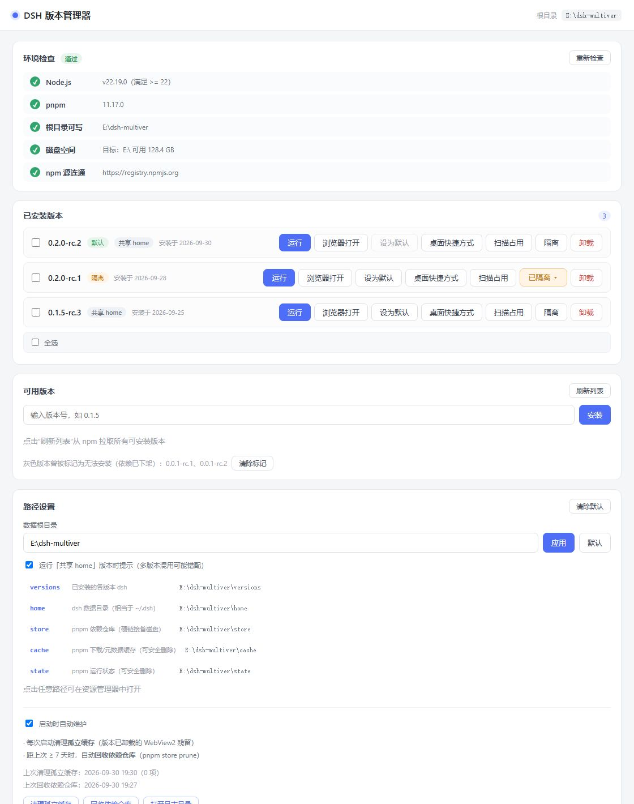

首次打开后，按这四步走：

1. **看环境检查** —— 界面顶部会自动检查 Node / pnpm / 磁盘 / npm 源。有缺失项会给出下载链接和安装步骤。**先把致命项（Node、pnpm）装好**。
2. **点「刷新列表」** —— 从 npm 拉取所有可安装的 dsh 版本。
3. **选一个版本安装** —— 点可用版本列表里的版本号，它会**填入输入框**，再点「安装」。观察进度条走完。
4. **点「运行」** —— 在应用内嵌窗口中打开该版本的 dsh Web 界面。

想让它成为终端里默认的 `dsh` 命令？见 [第六节](#六终端短命令-dsh)。

---

## 四、界面功能

### 环境自检

启动时自动检查 5 项：

| 检查项 | 是否致命 | 说明 |
| :--- | :--- | :--- |
| Node 版本 | ✅ 致命 | 需 `^22.19.0` 或 `>=24` |
| pnpm 可用 | ✅ 致命 | |
| 数据根可写 | ✅ 致命 | |
| 磁盘空间 | ⚠️ 非致命 | |
| npm 源连通 | ⚠️ 非致命 | |

缺失项会给出**一键下载链接**和安装步骤：

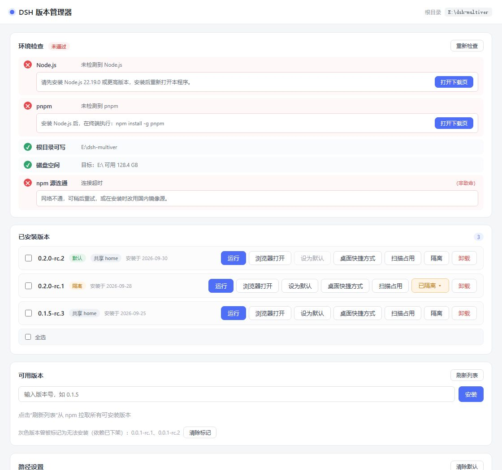

### 已安装版本

每个版本显示：版本号、安装日期、是否默认、是否隔离、占用大小。

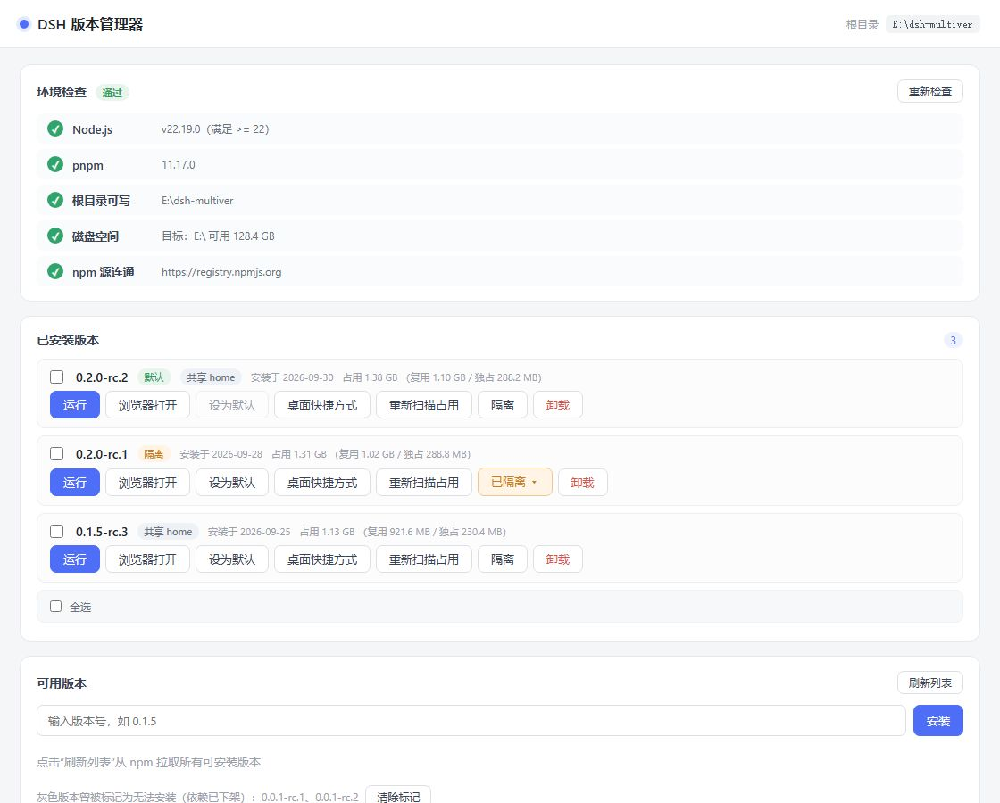

可用操作：

- **运行** —— 内嵌窗口打开（见第五节）
- **浏览器打开** —— 用系统浏览器打开
- **设为默认** —— 生成终端 `dsh` 短命令
- **隔离 / 已隔离 ▾** —— 数据隔离相关（见第七节）
- **快捷方式** —— 在桌面生成 `DSH <版本号>.lnk`
- **卸载**
- **扫描占用** —— 显示 `占用 1.38 GB（复用 1.10 GB / 独占 288 MB）`

> **占用里的「复用 / 独占」是什么**：多个版本通过 pnpm store 硬链接共享同一份依赖文件。「复用」是与其他版本共享的部分，「独占」是这个版本独有的部分。所以**卸载一个版本释放的空间往往远小于它显示的总占用**。

### 批量操作

已安装列表支持多选：

- 每个版本左侧有复选框，勾选后底部出现批量操作栏
- 「全选」选中本组，「清除选择」取消
- 「批量卸载」一次确认后逐个执行，实时显示进度，失败项汇总提示
- 批量进行中，**被选中条目的按钮会被禁用**（防呆），非选中条目不受影响

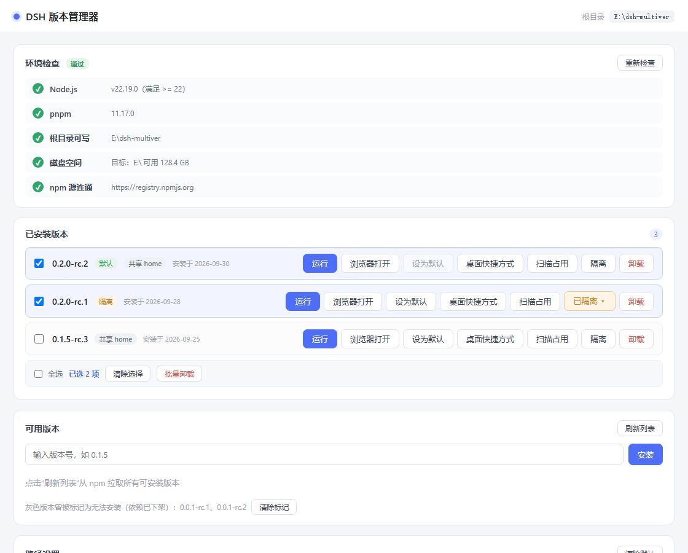

### 可用版本列表

- 支持**搜索**版本号
- 支持**排序**（最新在前 / 最早在前）
- 点版本号**填入输入框**，**同时在其下方就地展开该版本的更新说明**（再点一次收起）
- 更新说明数据来自 dsh 上游 GitHub Releases，经消毒后展示，附「在浏览器打开原文」按钮；
  同一版本看过一次后，再点（无论从「可用版本」还是「已安装版本」）都会立即显示
- **标灰划线的版本**是「已知安装失败」的（依赖已下架的私有包等），可以点「清除标记」后重试

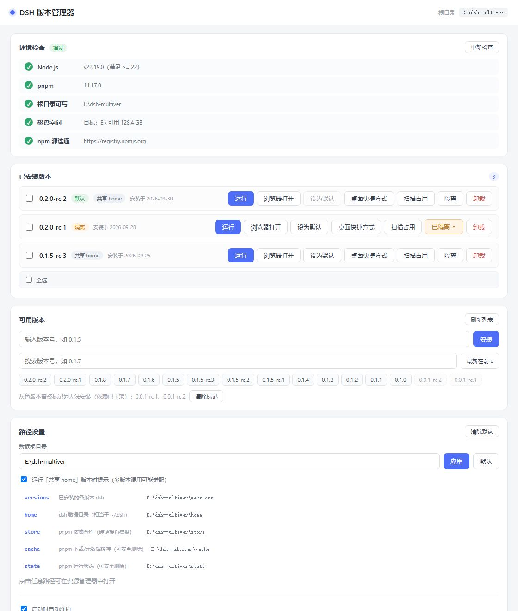

安装过程中的进度条：

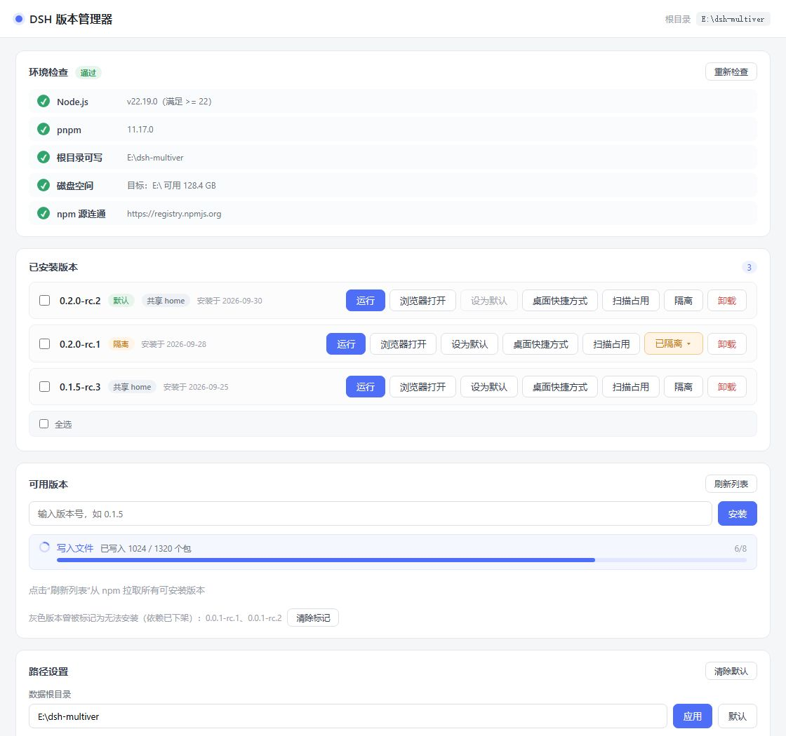

### 安装失败处理

安装失败时按错误类别给出针对性提示：

| 类别 | 提示 |
| :--- | :--- |
| **网络问题** | 弹出换源对话框（官方 / 阿里云 / 腾讯云 / 华为云 / 自定义），一键重试 |
| **私有包下架** | 该版本官方发布不全，任何源都装不了；版本会被标灰 |
| **版本不完整** | 同上，建议换更新的版本 |

网络问题的换源对话框：

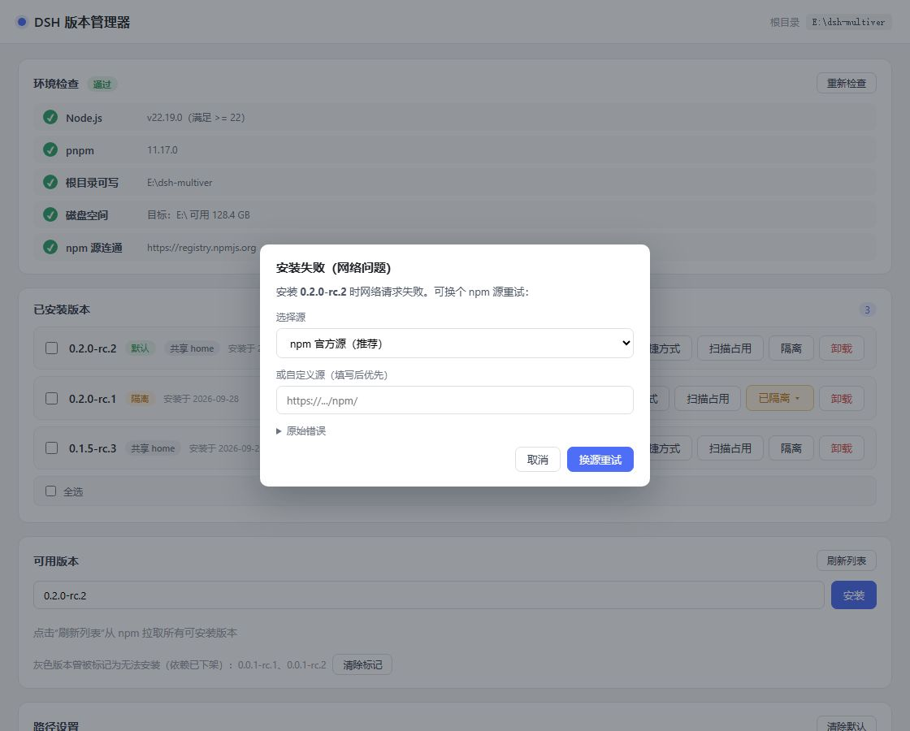

私有包下架的提示：

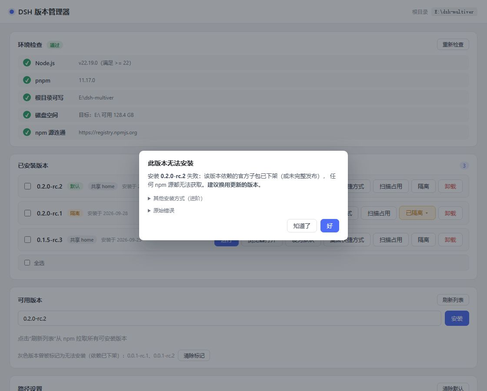

### 路径设置

可修改**数据根目录**（默认 exe 同目录；输入会自动去除首尾空格）。改完会同步更新终端 `dsh` 脚本里的路径。

下方列出各数据目录，**点击任意一行即在文件管理器打开**该目录。默认展示 5 个核心目录
（`versions` / `home` / `store` / `cache` / `state`），点「**展开全部目录**」可查看
`logs` / `webview` / `trash` / `assets` 等其余目录。

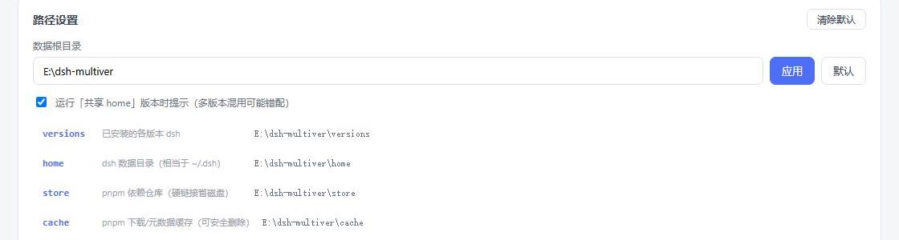

底部还有**维护区**（见第十节）。

---

## 五、运行 dsh 的三种方式

安装完成后，每个版本有三种启动途径：

### 1. 运行（内嵌窗口）—— 推荐

在应用内直接打开 dsh 的 Web 界面（默认 1100×760）。

- 每个版本使用**独立的 WebView2 数据目录**（`<数据根>/webview/<版本>`），cookie / 缓存互不污染
- 关闭窗口会自动终止该版本的 dsh 进程
- 同一版本再次运行会**先结束旧实例**再重新打开
- 窗口左上角有一个**小圆点**：悬停显示版本号，点击弹出面板（版本号 / 完整 URL / 重启 / 关闭）：

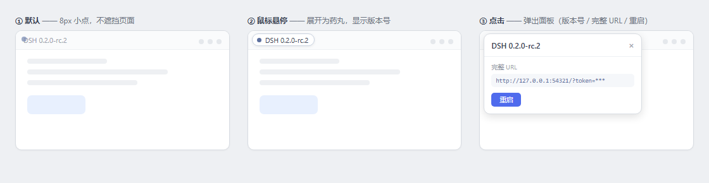

> 端口由系统自动分配（`--port 0`），不会冲突。

### 2. 浏览器打开

用一个**新控制台窗口**启动 dsh，并让 dsh 自动打开系统默认浏览器。

- 端口**固定 3080**
- 若 3080 被占用，会弹对话框让你选择「换随机端口」或取消
- 若该版本已在内嵌窗口运行，会先弹窗确认是否再开一个

> 适合想让 dsh 跑在真正的浏览器里（比如要用浏览器插件）的场景。

### 3. 桌面快捷方式

点「快捷方式」为当前版本在桌面生成 `DSH <版本号>.lnk`。

- 双击 = **精简启动**：不显示管理器主界面，直接打开该版本的内嵌窗口
- 所有窗口关闭后程序自动退出
- 适合把常玩的版本固定到桌面 / 任务栏

---

## 六、终端短命令 dsh

在某个版本上点「**设为默认**」，会在 `%APPDATA%\npm\` 生成一个 `dsh.cmd` 转发脚本（该目录通常已在系统 PATH）。

之后在**任意终端**直接敲：

```bash
dsh web          # 启动默认版本的 Web 界面
dsh doctor       # 其他子命令同样命中默认版本
dsh --version
```

### 它是怎么工作的

脚本里**写死了**版本号、根目录和 `DSH_HOME`（由程序生成时算好，不解析 JSON）。内容大致是：

```bat
set "VER=0.2.0-rc.1"
set "ROOT=D:\dsh-multiver"
set "DSH_HOME_CANDIDATE=D:\dsh-multiver\home"
...
call "%ROOT%\versions\%VER%\node_modules\.bin\dsh.cmd" %*
:: 以上为示例路径，实际由 dsh-multiver 在「设为默认」时按你的数据根目录生成
```

> 脚本内带保险：若 `DSH_HOME` 目录不存在，则不设该变量，回退到 dsh 默认位置（`~/.dsh`）。

**改默认版本、改根目录、改隔离状态、卸载默认版本**时，这个脚本会自动重新生成。没有默认版本时会删除它。

> ⚠️ 若终端提示 `'dsh' 不是内部或外部命令`，检查 `%APPDATA%\npm\` 是否在 PATH 里。

---

## 七、数据隔离

dsh 的数据目录（会话、配置、插件、凭据）由启动时注入的 `DSH_HOME` 决定：

| 版本类型 | DSH_HOME |
| :--- | :--- |
| **非隔离**（默认） | `<数据根>/home` —— 所有非隔离版本**共用** |
| **隔离** | `<数据根>/versions/<版本>/home` —— 该版本**独占** |

### 什么时候该开隔离

- 测试不兼容的插件，怕污染主力环境
- 想保持干净的会话历史 / 配置

> ⚠️ **共用 home 的风险**：非隔离版本共用同一个数据目录。若新版本的插件/配置与旧版本不兼容，可能**连累旧版本**。例如 dsh 0.1.7 的「打开文件夹」功能失效，在共享 home 下会影响所有版本。
>
> 遇到奇怪问题，可以给版本开隔离，或参见[常见问题](#十一常见问题)。

### 隔离相关操作

点「已隔离 ▾」菜单（下图中第二个版本为隔离状态）：

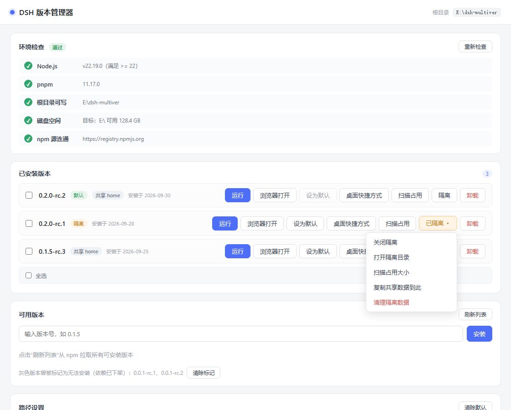

- **打开隔离目录** —— 在资源管理器里打开该版本的 home
- **扫描占用大小**
- **复制共享数据到此** —— 把共享 home 的内容复制过来（**不覆盖**已存在文件，会保留 junction）
- **清理隔离数据** —— 清空该版本的独立 home
- **关闭隔离** —— 回到共用 home（原有隔离数据保留在版本目录里，不删）

---

## 八、命令行模式（CLI）

> **v0.1.8 起支持**。适合脚本化、批处理、CI。

带任一 CLI 参数时，程序**不会启动图形界面**，执行完按退出码退出（成功 `0` / 失败 `1`）。

| 命令 | 用途 |
| :--- | :--- |
| `--list` | 列出已安装版本（一行一个；默认版本以 `* ` 前缀标记） |
| `--install <版本> [--registry <url>]` | 无头安装，可指定 npm 源 |
| `--uninstall <版本>` | 无头卸载 |
| `--set-default <版本>` | 设为默认版本，并重生成终端 `dsh` 命令 |
| `--maintenance [--cleanup\|--prune]` | 无头维护；不带子开关则两者都做 |
| `--help` / `-h` | 帮助 |
| `--version` / `-V` | 版本号 |

### 示例

```bash
# 看装了哪些版本（输出可直接管道）
dsh-multiver.exe --list

# 装一个版本
dsh-multiver.exe --install 0.2.0-rc.2

# 用指定源装（网络不好时）
dsh-multiver.exe --install 0.2.0-rc.2 --registry https://registry.npmmirror.com

# 设默认
dsh-multiver.exe --set-default 0.2.0-rc.2

# 卸载
dsh-multiver.exe --uninstall 0.1.5-rc.3

# 清理孤立缓存
dsh-multiver.exe --maintenance --cleanup

# 回收依赖仓库
dsh-multiver.exe --maintenance --prune
```

### 说明

- **无交互确认**：`--install` / `--uninstall` / `--set-default` 不会问「确定吗」，请确保参数正确
- **输出可管道**：`--list` 一行一个版本号；安装进度走 **stderr**，stdout 保持干净
- **进度显示**：只在真实终端下显示单行进度；重定向到文件/管道时自动静默
- **不带任何 CLI 参数**时，行为与之前完全一致：启动图形界面

---

## 九、数据存储结构

数据根目录默认 = **exe 所在目录**，可在界面「路径设置」里修改。运行后会在根目录下创建：

```
<数据根>/
├── config.json          # 配置（根目录、默认版本、隔离列表、失败版本列表、维护状态）
├── versions/<版本>/     # 各版本独立安装
│   ├── package.json
│   ├── .npmrc           # node-linker=hoisted
│   ├── node_modules/
│   └── home/            # 仅「隔离」版本才有
├── home/                # 共享 DSH_HOME（会话/配置/凭据，相当于 ~/.dsh）
├── store/               # pnpm store（硬链接去重，多版本共享）
├── cache/               # pnpm 缓存（可删）
├── state/               # pnpm 状态（可删）
├── webview/<版本>/      # 各版本内嵌窗口的 WebView2 数据（cookie/缓存隔离）
└── logs/                # 启动错误日志 + 维护日志
```

### 哪些可以安全删除

| 目录 | 能否删 | 说明 |
| :--- | :--- | :--- |
| `cache/` `state/` | ✅ 可删 | pnpm 缓存，删了会重新下载 |
| `webview/` | ✅ 可删 | 只是内嵌窗口的缓存，删了会重建 |
| `store/` | ⚠️ 谨慎 | **各版本依赖通过硬链接指向这里**，删了所有版本都失效 |
| `versions/` | ❌ 不要手删 | 请用界面「卸载」 |
| `home/` | ❌ 不要手删 | 你的会话和凭据 |

### 自包含原则

所有 pnpm 目录（`store` / `cache` / `state`）都被显式限定在数据根目录内，**不会写入 pnpm 的全局默认位置**（如 `%LOCALAPPDATA%\pnpm`、盘根 `.pnpm-store`）。

---

## 十、自动维护

程序启动时会在**后台线程**（不阻塞界面）做两件事：

1. **清理孤立 webview 缓存** —— 删除 `webview/` 下那些「对应版本已经不存在」的目录。每次启动都跑，成本极低。
2. **回收 pnpm store** —— 距上次 **7 天**以上时，以低优先级运行 `pnpm store prune`，回收不再被引用的依赖包。会延迟 30 秒错开启动 IO。

日志写在 `<数据根>/logs/maintenance.log`。

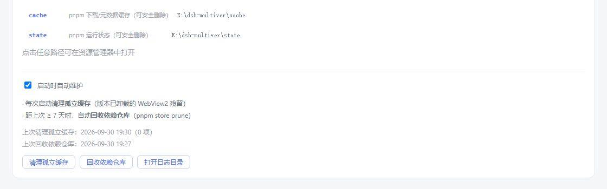

### 维护面板

在「路径设置」底部：

- **自动维护开关** —— 关掉则启动时不做上述两件事
- **规则说明** + **上次执行状态**
- **手动按钮**：「清理孤立缓存」「回收依赖仓库」「打开日志目录」

> 手动维护会立即执行，并更新配置里的时间戳。

---

## 十一、常见问题

### Q: 提示「创建窗口失败: failed to send message to the webview」

WebView2 数据目录被另一个实例占用。通常是**上一个实例还在启动中 / 关闭中**时立刻又启了一个。

**解决**：等几秒再试。

### Q: 内嵌窗口显示 431 错误 /「Failed to load plugins」

历史版本曾因**所有窗口共享同一个 WebView2 数据目录**，导致 cookie 累积、请求头膨胀。现在每个版本用独立目录（`webview/<版本>`）已根治。

若仍遇到，删掉对应的 `webview/<版本>` 目录让它重建。

### Q: 安装报「Cannot find package ... cordis」

依赖链接模式不对。每个版本目录会写 `.npmrc` → `node-linker=hoisted`，dsh 需要扁平的 node_modules。

若手工动过版本目录，删掉重新装。

### Q: 安装报 `ERR_PNPM_IGNORED_BUILDS`

pnpm 10+ 默认不执行依赖构建脚本，导致 node-pty / koffi 等原生模块缺失。工具安装时已带 `--config.dangerouslyAllowAllBuilds=true`，正常不会遇到。

### Q: 某个版本一直装不上，一直转圈然后失败

看错误提示类别：

- **私有包下架** —— 该版本官方发布不全，**任何源都装不了**，换版本
- **网络问题** —— 用换源重试（选阿里云 / 腾讯云）

> 已知装不了的早期版本：`0.0.1-rc.1`、`0.0.1-rc.2`（依赖已下架的私有包）。这类版本会自动标灰。

### Q: dsh 的「打开文件夹」功能没反应

这是 **dsh 0.1.7+ 的上游 bug**：给 `explorer.exe` 传了 `windowsHide:true`，导致文件夹窗口隐形；且返回码误判，API 仍返回成功。

**在共享 home 下会连累所有版本。**

**规避方式**：

1. 安装社区修复插件：
   ```bash
   dsh plugin --profile web add github:King20260919/dsh-open-folder-visible
   ```
2. 或给该版本开启**数据隔离**（见第七节）

### Q: 终端敲 `dsh` 提示找不到命令

`%APPDATA%\npm\` 需要在系统 PATH 里。检查环境变量，或重启终端让 PATH 生效。

### Q: 卸载版本时提示「文件被占用」

该版本的 dsh 进程还在运行。

**解决**：关掉对应的内嵌窗口 / 终端，再重试。

### Q: 更新 exe 后图标没变

Windows 图标有缓存。

**解决**：执行 `ie4uinit.exe -show`，或重启资源管理器。

### Q: 版本列表里有些版本是灰的

这些是**已知安装失败**的版本（依赖已下架的私有包）。装不上是正常的。

若确认要重试，点「清除标记」后即可再次安装。

---

## 十二、卸载

本工具是**便携版**，不写注册表、不装服务。

要完全卸载：

1. 关闭所有内嵌窗口
2. 如果设过默认版本，先点「设为默认」的清除，或直接删掉 `%APPDATA%\npm\dsh.cmd`
3. 删掉 `dsh-multiver.exe`
4. 删掉**数据根目录**（默认是 exe 所在目录，里面有 `versions/` `home/` `store/` 等）

> ⚠️ 第 4 步会**永久删除所有 dsh 版本的会话、配置、凭据**。如果只想清理某个版本，用界面里的「卸载」。

---

## 十三、Linux 支持

dsh-multiver **原生支持 Linux**，已在 Debian 13 上完成编译、测试、GUI、CLI、进程清理的验证。官方产物为 **AppImage** 与 **deb**。

### 安装

从 [Releases](https://github.com/K1-lihongrong/dsh-multiver/releases) 下载：

- **AppImage（通用，推荐）**：
  ~~~bash
  chmod +x dsh-multiver_*_amd64.AppImage
  ./dsh-multiver_*_amd64.AppImage
  ~~~
- **deb（Debian/Ubuntu）**：
  ~~~bash
  sudo dpkg -i dsh-multiver_*_amd64.deb
  ~~~

### 功能

- **功能**：安装/卸载/运行/隔离/CLI/转发脚本等均已适配
- **进程管理**：Windows 用 Job Object、Linux 用进程组 + PDEATHSIG，都能在管理器退出时清理 dsh 进程
- **桌面集成**：Windows 生成 `.lnk`，Linux 生成 `.desktop`（放桌面；无桌面环境时给出提示）
- **终端短命令**：Windows 写 `%APPDATA%\npm\dsh.cmd`，Linux 写 `~/.local/bin/dsh`

### 从源码构建（需先装 Rust、Node、pnpm 及 WebKitGTK 等系统依赖）

~~~bash
pnpm install
pnpm tauri build --bundles appimage,deb   # 或 pnpm tauri dev 开发运行
~~~

> 已知：在 **WSLg** 环境下，内嵌窗口可能显示"重新连接中"（WSLg 专属问题，真 Linux 桌面通常正常）；
> 受影响时可改用界面上的「浏览器打开」。详见 [开发缺口](开发缺口.md) GAP-008。

---

## 相关链接

- [项目主页](https://github.com/K1-lihongrong/dsh-multiver)
- [Releases（下载）](https://github.com/K1-lihongrong/dsh-multiver/releases)
- [更新日志](https://github.com/K1-lihongrong/dsh-multiver/blob/main/CHANGELOG.md)
- [问题日志查看指南](问题日志查看指南.md) —— 遇到问题时如何查日志
- [DeepSeek Harness](https://github.com/deepseek-ai/deepseek-harness) —— 本项目管理的对象
